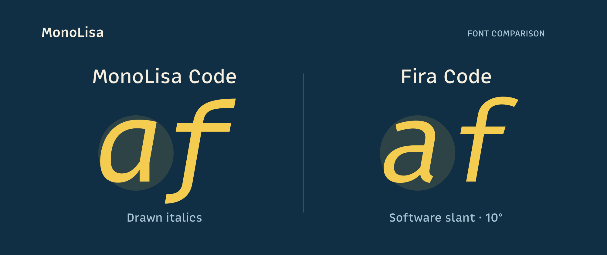
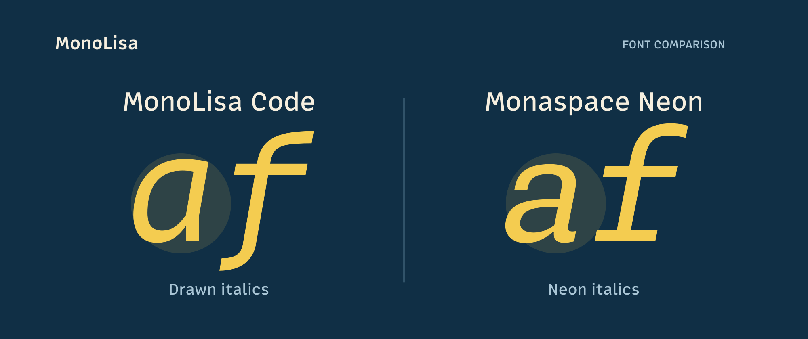
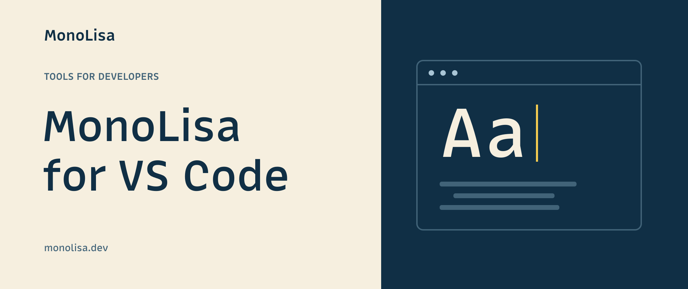
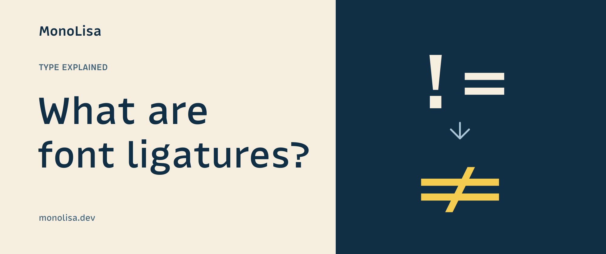
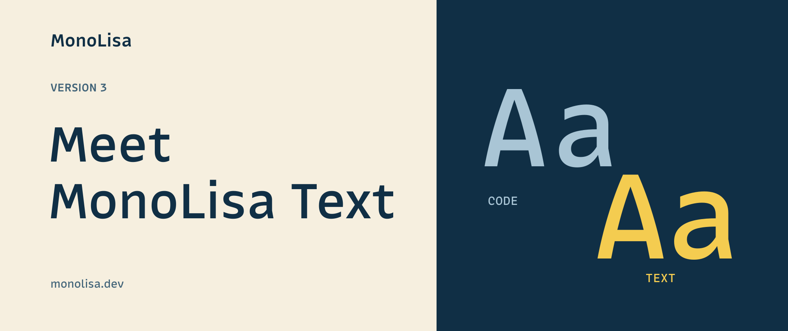
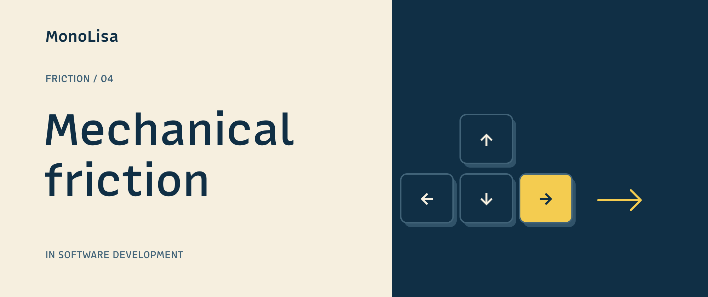
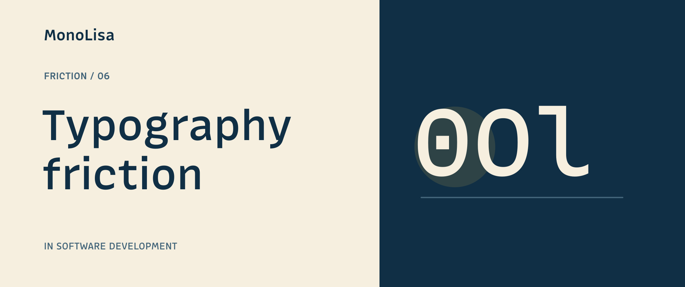

# DEV cover images

These covers identify the topic at a glance and give MonoLisa's DEV archive a
consistent visual identity. They are entry points to the articles; the detailed
comparison graphics and optional infographics stay in the articles.

## Research and design decisions

Checked against primary sources on 2026-09-25:

- [DEV's editor guide](https://dev.to/p/editor_guide) recommends a 1000 × 420
  cover and accepts an image URL. Our PNGs are 2000 × 840, keeping that ratio
  while providing twice the resolution.
- The [Forem V1 API](https://developers.forem.com/api/v1#tag/articles/operation/updateArticle)
  calls this field `main_image` and supports updating individual article fields.
  The cover publisher therefore sends only `article.main_image`.
- The initial account inventory contained 16 published articles: 15 without
  covers, plus the version 3 announcement with an existing cover. This set
  covers all 16, including a refreshed version 3 image.

Large titles and one visual idea keep the covers legible at feed size. Navy,
cream, yellow, real MonoLisa outlines, and restrained circles connect them to
the website and comparison illustrations. There are no feature tables, small
specification lists, or calls to action. Important content sits away from the
edges; the files were inspected together and as thumbnails. These are design
decisions, not a claim of measured engagement improvement.

The comparison covers show actual `af` outlines at equal nominal sizes. Fira
Code uses the same 10° software slant documented in its article; Monaspace uses
Neon's italic file. Both sides receive the same visual emphasis. The ligature
cover shows MonoLisa Code's `!=` before and after enabling `dlig`; the serif
cover uses Georgia's capital `I`. Friction illustrations connect to each
article's specific subject: interrupted context, process queues, tool
connections, communication, or organizational handoffs.

DEV currently supplies the cover's accessible description from the article
title. The covers carry no essential information that is absent from the text.

## Render

```bash
npm run render:devto-covers
npm run render:devto-covers -- monolisa_vs_fira_code
```

Requires `hb-view` (HarfBuzz), `rsvg-convert` (librsvg), and licensed local font
files. Code and comparison font paths come from
`scripts/comparison-fonts.local.json`, falling back to
`scripts/comparison-fonts.json`. Set `COMPARISON_FONT_CONFIG` to use another
config. `MONOLISA_TEXT_FONT` and `SERIF_FONT` override the renderer's macOS
defaults for MonoLisa Text Upright and Georgia. Font files are not committed or
embedded: the SVGs contain outlines, and the PNGs are the upload assets.

Edit `scripts/devto-cover-designs.json` to change titles or register a post.
Add its illustration in `scripts/render-devto-covers.mjs` when needed. Review
the SVG and PNG after rendering; commit both. Headings use MonoLisa Text,
specimens use MonoLisa Code or the named comparison font.

## Publish or refresh covers

```bash
npm run publish:devto-covers -- --all --dry-run
npm run publish:devto-covers -- --all
npm run publish:devto-covers -- monolisa_vs_fira_code
```

The dry run is offline and validates every selected source and PNG. A real run
uses `DEVTO_API_KEY` and `BLOB_READ_WRITE_TOKEN` from `.env.private`. It checks
the DEV account, discovers published articles by their MonoLisa canonical URL,
and refuses missing or ambiguous matches. It does not create or publish posts.
After publishing a new article with `publish:draft --devto`, run the cover
command for its slug.

Covers use a dedicated public Blob prefix, `devto-covers/`, with a SHA-256 in
each filename. This avoids stale proxy images when a design changes. Existing
article-body images continue to use DEV's native upload storage. Cover updates
need no session cookie or website cache invalidation. Keep these Blob objects
available while DEV articles refer to them.

The publisher verifies the hosted PNG, saves successful upload URLs in the
ignored `.devto-covers-state.json`, and writes a full before-update article
backup under ignored `.devto-cover-backups/`. It sends a cover-only PUT and
reads the article back to verify the cover, text, title, tags, canonical URL,
publication date, description, and series membership. The first unexpected
change stops the run. Repeating the command reuses uploads and skips covers
already applied. Old cover objects are retained; no automatic deletion occurs.

To restore a previous cover, use the backup's `cover_image` URL (or `null` for
no cover) as the `article.main_image` in a cover-only API update. Do not replay
the full article backup over subsequent editorial changes.

## Gallery

| Comparison | Comparison |
| --- | --- |
|  |  |

| Tools and release | Typography |
| --- | --- |
|  |  |
|  |  |

| Friction series | Friction series |
| --- | --- |
|  |  |
|  |  |
|  |  |
|  |  |
|  |  |
